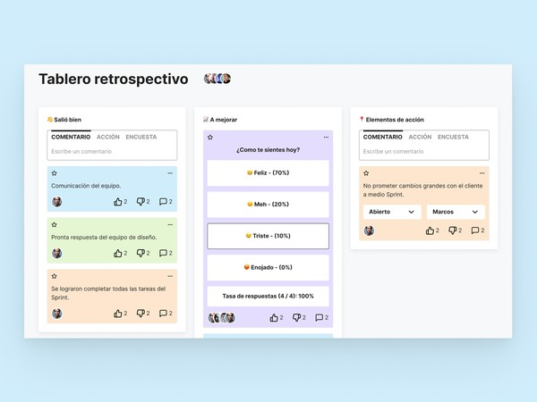

# Tablero retrospectivo
Mejora la comunicación y efectividad de las retrospectivas de tu equipo con esta aplicación.

## Clasificación de actividades según el seniority
En esta sección mostraremos los retos a seguir según el seniority del Menty o de lo que desee practicar

### Training
  * Maquetar en HTML (Versión de escritorio)
  * Dar estilos con CSS (Versión de escritorio)

### Junior
  * Maquetar en HTML (Versión de Mobile)
  * Dar estilos con CSS (Versión de Mobile)

### Junior Advance
  * Agregar funcionalidad y dinamismo a la web haciendo uso de Drag and Drop con JavaScript

### Semi Senior
  * Haciendo uso del LocalStorage manten la información gestionada aunque el navegador sea recargado

### Senior
  * Implementa React
  * Implementa TypeScript

### Senior Advance
  * Realizar una historia de usuario
  * Hacer uso de flujo de Scrum Master
  * Planear las pruebas unitarias

## Archivos
En el siguiente [Link](https://drive.google.com/drive/folders/1pjczJ_KPODtd57NcMYbKhqHuk0dspiEK?usp=sharing) encontrarás lo siguiente:
  - Estructura de carpetas.
  - Fuentes para empezar tu proyecto.
  - Diseño en Figma.